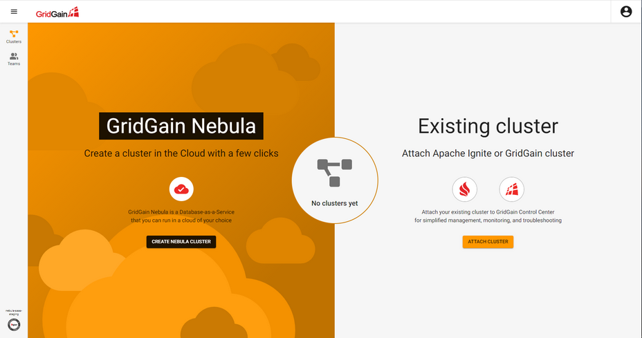
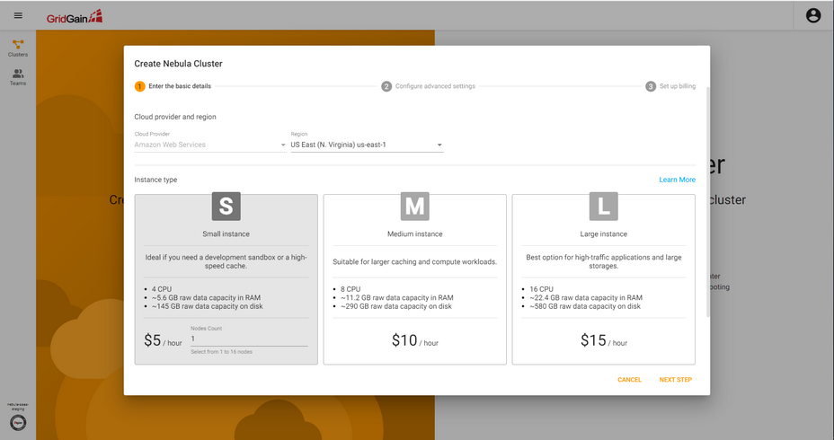
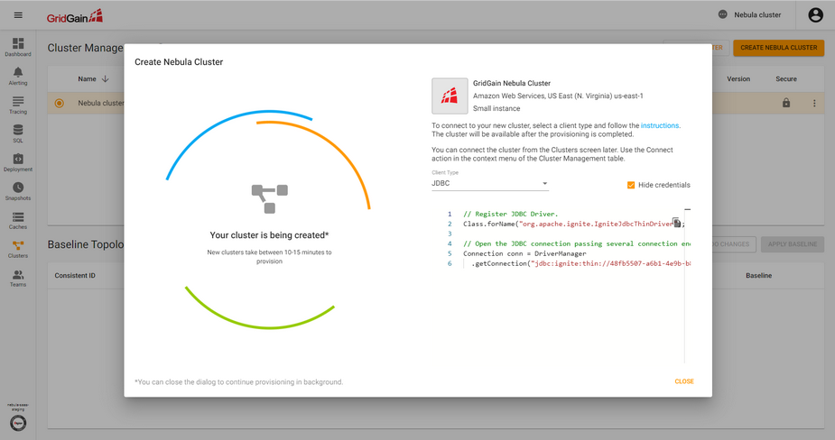
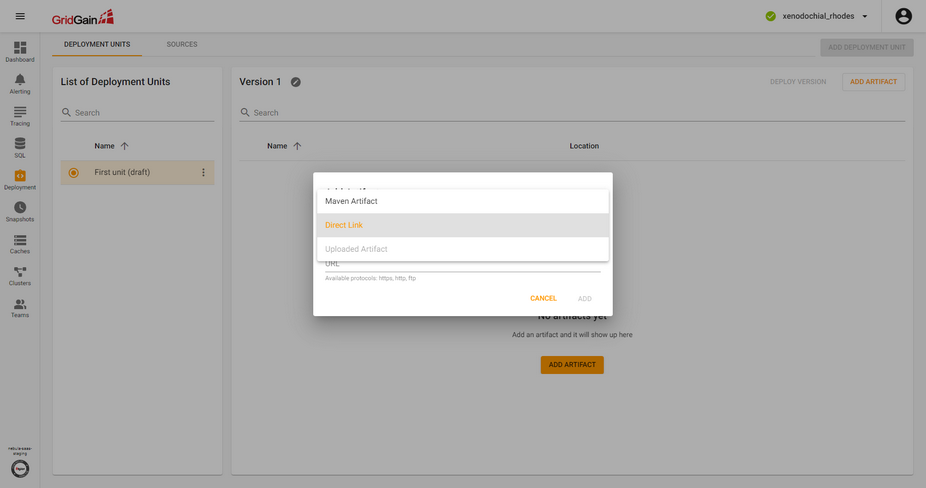
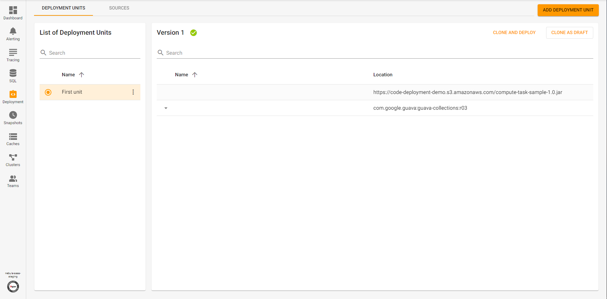
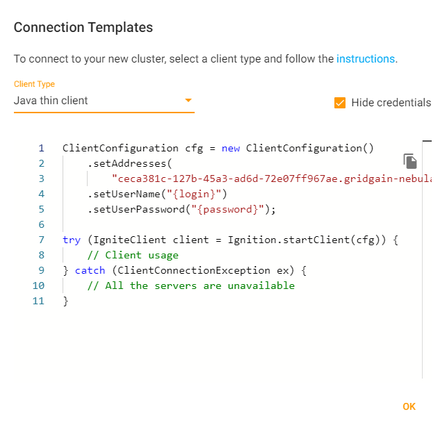

# GridGain code deployment demo

This demo shows how to deploy compute tasks to Gridgain Nebula cluster and run them right from the client`s application.

1. Navigate to [https://staging-ggcc.gridgain.com/](https://staging-ggcc.gridgain.com/)<br>

2. Click "Create Nebula Cluster"<br>

3. You can choose Small Instance and fill in "Nodes Count" field 1 to provision simple 1-node cluster<br>

4. Wait till the cluster is successfully provisioned
5. Ensure the cluster is selected on the Cluster Managerment tab (menu "Clusters")
6. Go to Deployment menu and create a new deployment
7. Click "Add artifact" and open a menu with types of artifacts, that you can choose<br>

8. Create following artifacts:<br>
Direct Link artifact with url `https://code-deployment-demo.s3.amazonaws.com/compute-task-sample-1.0.jar`<br>
Maven artifact with coordinate `com.google.guava:guava-collections:r03`, which is a transitive dependency of the compute task<br>
<br>
9. Go to the Clusters, click "..." on the right and choose "Connect". Copy connection url to the cluster from there
<br>
10. Go to [ThinClientApp](./client-node-starter/src/main/java/org/gridgain/demo/ThinClientApp.java) class
11. Fill copied connection url to `ADDRESSES` field.
12. Run the application. It executes a job on cluster and you should see 
its output on the client node:
    ```text
    >> Execute org.gridgain.demo.CityFilterTask job
    >> Job result:
    [Barcelona, Bilbao, Córdoba, Gijón, Madrid, Mallorca, Murcia, Málaga, Sevilla, Valencia, Valladolid, Vigo, Zaragoza]
    >> Compute task is executed, check for output on the server nodes.
    ``` 
   and the following output on the server node:
    ```text
    >> Executing the compute task
    >> Found 13 cities with code SPA
    ```
13. [Optional] Go to the compute task class [CityFilterTask.java](/compute-task-executor/src/main/java/org.gridgain/demo/CityFilterTask.java)
and invert comments on 26-27 rows:
    ```java
       CityComputeJob job = new CityComputeJob(CountryCode.SPA);
    // CityComputeJob job = new CityComputeJob(CountryCode.FRA);
    ```
14. [Optional] Perform point 5, 6, 7 again and you should get the following output:
    ```text
    >> Execute org.gridgain.demo.CityFilterTask job
    >> Job result:
    [Angers, Bordeaux, Brest, Dijon, Grenoble, Lille, Lyon, Marseille, Montpellier, Nantes, Nice, Paris, Reims, Rennes, Strasbourg, Toulon, Toulouse]
    >> Compute task is executed, check for output on the server nodes.
    ```
    and on the server node side:
    ```text
    >> Executing the compute task
    >> Found 17 cities with code FRA
    ```
